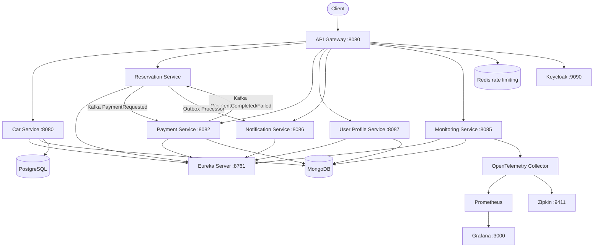
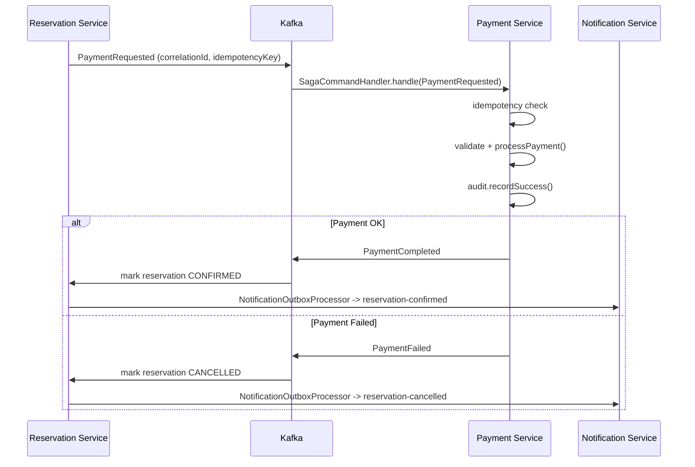

# CarRentalApp - Microservices Platform

CarRentalApp is a cloud-native, microservices-based platform designed for scalable vehicle rental operations. The system follows a modular architecture with independent services communicating through REST, Kafka messaging, service discovery, and distributed tracing. The platform is optimized for Kubernetes, observability, CI/CD automation, and high availability.

## Architecture Overview



## Payment Saga Flow



## Key Platform Features

### Service Discovery
Eureka Server provides dynamic registration and lookup for all microservices.

### API Gateway
Handles routing, authentication, Redis rate limiting, Resilience4j circuit breakers, canary deployments, and distributed tracing.

### Observability
- OpenTelemetry tracing (OTLP)
- Micrometer metrics
- Prometheus scraping
- Grafana dashboards
- Structured logging with correlation IDs

### Resilience
- Resilience4j circuit breakers
- Redis rate limiting
- Canary routing for progressive deployments

### Security
- Keycloak for identity and access management
- JWT validation at the gateway
- Role-based access control

### CI/CD
- GitHub Actions CI for every service (build, test, Docker image)
- Jenkins pipeline for container builds and deployments
- Docker multi-stage images for all services

## Project Structure

```
CarRentalApp/
|
+-- api-gateway/          # Spring Cloud Gateway, Redis, Resilience4j
+-- eureka-server/        # Service discovery
+-- car-service/          # Hexagonal arch, CQRS, Outbox, dual persistence (JPA+MongoDB)
+-- reservation-service/  # Saga orchestration, BDD Cucumber, NotificationOutbox
+-- payment-service/      # Stripe, idempotency, audit, Saga
+-- user-profile-service/ # OAuth2/Keycloak, MongoDB
+-- notification-service/ # Email/SMS/push notifications
+-- monitoring-service/   # WebFlux, reactive MongoDB, audit events
+-- k8s/                  # Kubernetes manifests
+-- charts/               # Helm chart
+-- docker-compose.yml
+-- Makefile
\-- pom.xml               # Parent POM
```

## Technology Stack

| Layer | Technology |
|---|---|
| Language | Java 21 |
| Framework | Spring Boot 3, Spring Cloud 2023 |
| API | Spring Cloud Gateway, Spring MVC, Spring WebFlux |
| Messaging | Apache Kafka |
| Persistence | Spring Data JPA, Spring Data MongoDB |
| Security | Keycloak, OAuth2, JWT |
| Service Discovery | Eureka Server |
| Resilience | Resilience4j |
| Caching / Rate Limiting | Redis |
| Observability | OpenTelemetry, Micrometer, Prometheus, Grafana, Zipkin |
| Testing | JUnit 5, Mockito, Testcontainers, Cucumber (BDD) |
| Containerisation | Docker, Docker Compose |
| Orchestration | Kubernetes, Helm |
| CI/CD | GitHub Actions, Jenkins |

## Build & Run

Build all modules:
```bash
mvn clean install
```

Start the full platform locally (Docker Compose):
```bash
make up
```

Run a single service with the OpenTelemetry agent:
```bash
make run SERVICE=car-service
```

## API Documentation

Each service exposes Swagger UI at `/swagger-ui.html`:

| Service | URL |
|---|---|
| Car Service | http://localhost:8080/swagger-ui.html |
| Payment Service | http://localhost:8082/swagger-ui.html |
| User Profile Service | http://localhost:8087/swagger-ui.html |
| Notification Service | http://localhost:8086/swagger-ui.html |
| Monitoring Service | http://localhost:8085/swagger-ui.html |
